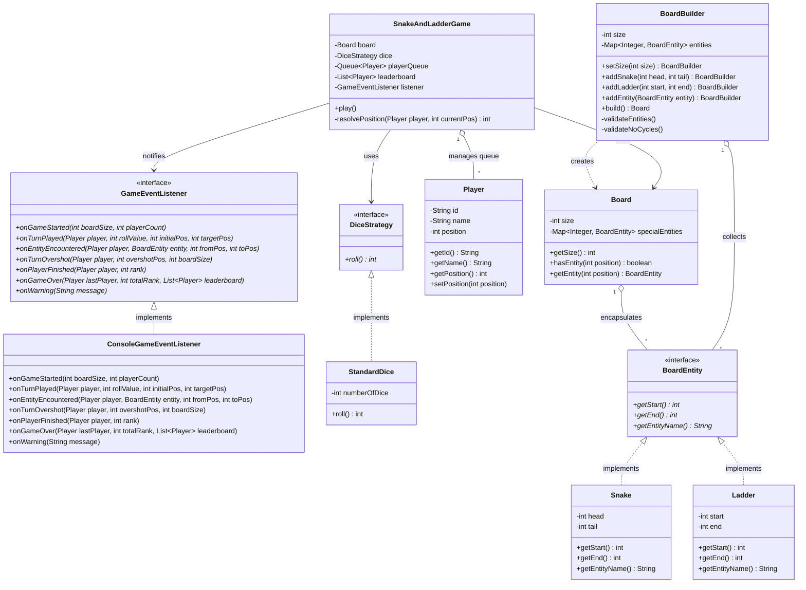

# Snake & Ladder System Design (LLD - Enterprise Edition)

> **Type:** Low-Level System Design / Machine Coding
> **Core Intent:** Enterprise-grade Snake & Ladder engine featuring Observer Pattern for UI decoupling, Builder Pattern for safe board construction, Static Cycle Validation to prevent board creation loops, Strategy Pattern for dice, and Polymorphic Board Entities.

---

## 📊 Architecture Diagram

---

## 🔑 Standard UML Notation Legend

| UML Visual Symbol | Relationship Type | Meaning & Ownership | Exact Example (Snake & Ladder Domain) |
|---|---|---|---|
| `- - - - ▷` | Realization | Class implements an Interface contract | `ConsoleGameEventListener - - - - ▷ GameEventListener` `StandardDice - - - - ▷ DiceStrategy` `Snake / Ladder - - - - ▷ BoardEntity` |
| `──────── ▷` | Generalization | Subclass extends a Base/Abstract Class | `ConcreteClass ──────── ▷ AbstractClass` |
| `◇───────` | Aggregation | Hollow Diamond = Weak "Has-a" (components exist independently) | `Board (1) ◇─────── BoardEntity (*)` `BoardBuilder (1) ◇─────── BoardEntity (*)` `SnakeAndLadderGame (1) ◇─────── Player (*)` |
| `◆───────` | Composition | Solid Diamond = Strong "Has-a" (components share lifecycle with owner) | `Board (1) ◆─────── Tile / Square (*)` |
| `────────>` | Association | One class holds a structural reference to another class | `SnakeAndLadderGame ────────> Board` `SnakeAndLadderGame ────────> DiceStrategy` `SnakeAndLadderGame ────────> GameEventListener` |
| `- - - - >` | Dependency | Transient usage (e.g., instantiated in main, builder returns product) | `BoardBuilder - - - - > Board` `Main - - - - > SnakeAndLadderGame` |

---

## 📖 System Architecture & Design Overview

The system decouples **Game Core Logic**, **UI/Output Rendering**, **Board Validation**, and **Dice Generation**:

- **Observer Pattern (UI/Engine Decoupling):** Core game execution emits state events (`onTurnPlayed`, `onEntityEncountered`, `onPlayerFinished`, `onGameOver`) to `GameEventListener`. Output can be seamlessly routed to Console, WebSockets, or UI frameworks without modifying the core game engine.
- **Builder Pattern with Static Graph Validation:** `BoardBuilder` validates board constraints, overlapping entities, and detects cyclic placement traps before constructing the immutable `Board` instance.
- **Immutable Board Domain:** `Board` encapsulates its entity registry using an unmodifiable map (`Collections.unmodifiableMap`), ensuring entity arrangements cannot be modified at runtime.
- **Polymorphic Entities & Pluggable Strategies:** Tile triggers implement `BoardEntity`, while dice rules implement `DiceStrategy` to allow extensible gameplay variations.

---

## 🏗️ Core Class Breakdown & Responsibilities

| Component | Class / Interface | Responsibility & Technical Details |
|---|---|---|
| 1. Event Listener (Observer) | `GameEventListener` `ConsoleGameEventListener` | Decouples engine events from rendering logic. Listens for turn progression, board triggers, win states, and warnings. |
| 2. Dice Strategy | `DiceStrategy` `StandardDice` | Strategy interface for dice rolling. `StandardDice` encapsulates `ThreadLocalRandom` over N dice rolls for high concurrency efficiency. |
| 3. Board Entity Strategy | `BoardEntity` `Snake` `Ladder` | Polymorphic contract for tile jump triggers (start → end). Constructor invariants enforce logical positions (tail < head for Snakes, end > start for Ladders). |
| 4. Board Builder & Validation | `BoardBuilder` `Board` | Guarantees safe creation. Validates bounds, duplicate start locations, and infinite jump loops using depth-first graph checks prior to board instantiation. |
| 5. Game Orchestrator | `SnakeAndLadderGame` | Controls the round-robin queue execution, handles overshoot logic, enforces dynamic jump limits, and emits state transitions to the event listener. |

---

## 🎯 SOLID Principles & Design Patterns Mapping

### 1. Observer Pattern
**Decoupled System Output:** The `SnakeAndLadderGame` engine does not contain `System.out.println` statements. It reports state changes to `GameEventListener`. Implementations like `ConsoleGameEventListener` format console logs, while alternative listeners can emit WebSocket payloads or update graphical interfaces.

### 2. Builder Pattern & Pre-Execution Validation
**Safe State Construction:** `BoardBuilder` collects setup configurations, verifies boundary ranges (`validateEntities`), and detects recursive loops (`validateNoCycles`). If a cycle is detected, `build` fails with an exception before game launch.

### 3. Single Responsibility Principle (SRP)
- `Player`: Stores player identity and position.
- `BoardBuilder`: Validates board geometry and constructs the `Board`.
- `SnakeAndLadderGame`: Coordinates turn order, movement resolution, and win conditions.

### 4. Open/Closed Principle (OCP)
- **Entities:** Introduce new board elements (Portal, Pitfall, Trampoline) by implementing `BoardEntity` without altering `Board` or `SnakeAndLadderGame`.
- **Output Modes:** Add streaming or database logging by providing a new implementation of `GameEventListener`.

### 5. Liskov Substitution Principle (LSP)
`Snake` and `Ladder` fulfill the contract defined by `BoardEntity`. The game engine interacts uniformly with `BoardEntity` objects without type-checking (`instanceof`).

### 6. Interface Segregation Principle (ISP)
Interfaces (`DiceStrategy`, `BoardEntity`, `GameEventListener`) are narrowly scoped to their specific domains to prevent forcing classes to implement unused methods.

### 7. Dependency Inversion Principle (DIP)
High-level orchestrator (`SnakeAndLadderGame`) relies strictly on interfaces (`BoardEntity`, `DiceStrategy`, `GameEventListener`), protecting core logic from concrete implementations.

---

## ⚙️ Key Algorithms & Edge-Case Guardrails

### 1. Static Graph Cycle Detection (Build Time)
- **Algorithm:** Set-based cycle detection in `BoardBuilder.validateNoCycles()`.
- **Logic:** Traverses each entity starting position (`curr = entity.getEnd()`). If a square is revisited during single-path tracing, an `IllegalStateException` halts creation to prevent infinite jump loops.

### 2. Dynamic Jump Limit Guard (Run Time)
- **Algorithm:** Transition counter in `resolvePosition()`.
- **Logic:** Caps entity transition chains at `maxTransitionsAllowed = 10`. If dynamic tile interactions exceed this threshold, resolution terminates and emits an `onWarning` event to prevent execution deadlocks.

### 3. Exact-Landing (Overshoot Guard)
- **Logic:** If `targetPos > boardSize`, the move is invalid. The game triggers `onTurnOvershot`, skips the movement, and re-queues the player at their current location.

---

## 💡 Potential Interview Extensions & Follow-Ups

| Follow-up Requirement | Architectural Solution |
|---|---|
| "Decouple UI for Web Application / Socket stream." | Implement `WebSocketGameEventListener implements GameEventListener` and inject it into `SnakeAndLadderGame`. Core engine remains unchanged. |
| "Detect cyclic snake and ladder boards before starting." | Pre-validated in `BoardBuilder.validateNoCycles()` using graph traversal at build time. |
| "Prevent runtime modification of board entities." | Enforced via `Collections.unmodifiableMap` inside the `Board` constructor. |
| "Support rolling a 6 grants an extra turn." | Update `SnakeAndLadderGame.play()` turn logic to check `rollValue == 6`, using `LinkedList.addFirst()` on `playerQueue` to reissue turn. |
