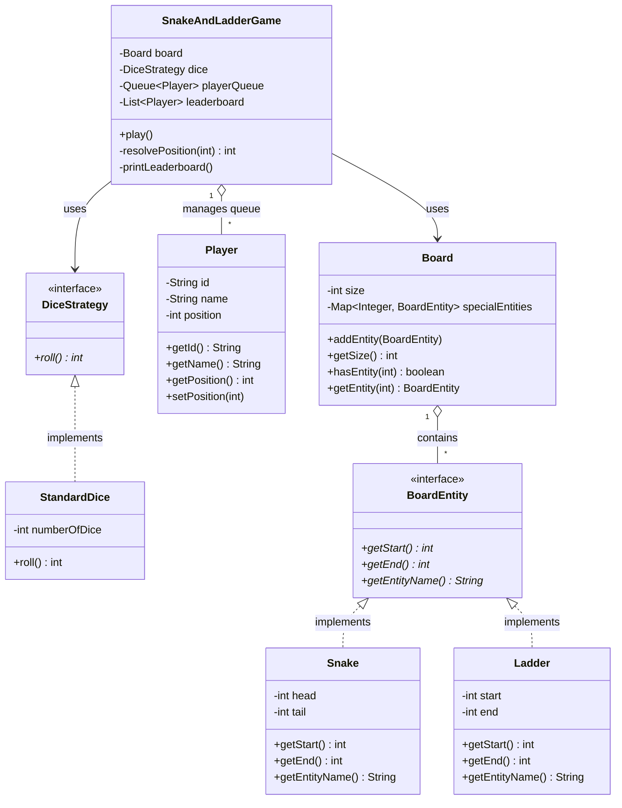

# Snake & Ladder System Design (LLD)

> [!NOTE]
> **Type:** Low-Level System Design / Machine Coding  
> **Core Intent:** Design an extensible, modular, and robust Snake & Ladder game supporting multiple players, customizable dice strategies, polymorphic board entities, and infinite-loop protection.

## 📊 Architecture Diagram

---

## 🔑 Standard UML Notation Legend

| UML Visual Symbol | Relationship Type | Meaning & Ownership | Exact Example (Snake & Ladder Domain) |
| :---: | :--- | :--- | :--- |
| `- - - - ▷` | **Realization** | Class implements an Interface contract | `StandardDice` `- - - - ▷` `DiceStrategy` `Snake` / `Ladder` `- - - - ▷` `BoardEntity` |
| `──────── ▷` | **Generalization** | Subclass extends a Base/Abstract Class | `ConcreteClass` `──────── ▷` `AbstractClass` |
| `◇───────` | **Aggregation** | **Hollow Diamond** = Weak "Has-a" (components exist independently) | `Board` (1) `◇───────` `BoardEntity` (*) `SnakeAndLadderGame` (1) `◇───────` `Player` (*) |
| `◆───────` | **Composition** | **Solid Diamond** = Strong "Has-a" (components share lifecycle with owner) | `Board` (1) `◆───────` `Tile / Square` (*) |
| `────────>` | **Association** | One class holds a structural reference to another class | `SnakeAndLadderGame` `────────>` `Board` `SnakeAndLadderGame` `────────>` `DiceStrategy` |
| `- - - - >` | **Dependency** | Transient usage (e.g., instantiated in main or passed as parameter) | `Main` `- - - - >` `SnakeAndLadderGame` |

---

# Low-Level Design Notes: Snake & Ladder System

## 📖 System Architecture & Design Overview

The architecture cleanly decouples **Game Loop Orchestration**, **Tile Movement/Jump Logic**, and **Random Value Generation**:

* **State-Driven Entities:** All jump mechanics ($start \rightarrow end$) are polymorphic instances of `BoardEntity`, removing conditional `if (isSnake) ... else if (isLadder)` checks from the game engine.
* **Pluggable Strategies:** Randomness logic is abstracted behind `DiceStrategy`, allowing dynamic injection of custom dice logic (e.g., multi-dice, loaded dice, crooked dice).
* **Queue-Based Game State:** Player turn scheduling uses a FIFO Queue (`Queue<Player>`), facilitating multi-player round-robin mechanics and clean removal of players upon winning.

---

## 🏗️ Core Class Breakdown & Responsibilities

| Component | Class / Interface | Responsibility & Technical Details |
| :--- | :--- | :--- |
| **1. Dice Strategy** | `DiceStrategy` `StandardDice` | Interface for dice logic. `StandardDice` encapsulates `ThreadLocalRandom` generation over $N$ dice rolls to ensure thread efficiency and eliminate contention. |
| **2. Board Entity** | `BoardEntity` `Snake` `Ladder` | Polymorphic contract for board triggers. Enforces invariant validations in constructors (e.g., $tail < head$ for Snakes, $end > start$ for Ladders). |
| **3. Domain Models** | `Player` `Board` | Core state objects. `Player` maintains identity and position. `Board` encapsulates spatial limits and a Hash Map mapping start positions to `BoardEntity` objects ($O(1)$ lookup). |
| **4. Game Orchestrator** | `SnakeAndLadderGame` | Drives turn transitions, evaluates move validity (overshoot checks), recursively/iteratively resolves position chains, tracks win conditions, and generates final rankings. |

---

# Low-Level Design Notes: Snake & Ladder System

## 📖 System Architecture & Design Overview

The architecture cleanly decouples **Game Loop Orchestration**, **Tile Movement/Jump Logic**, and **Random Value Generation**:

* **State-Driven Entities:** All jump mechanics (start → end) are polymorphic instances of `BoardEntity`, removing conditional `if (isSnake) ... else if (isLadder)` checks from the game engine.
* **Pluggable Strategies:** Randomness logic is abstracted behind `DiceStrategy`, allowing dynamic injection of custom dice logic (e.g., multi-dice, loaded dice, crooked dice).
* **Queue-Based Game State:** Player turn scheduling uses a FIFO Queue (`Queue<Player>`), facilitating multi-player round-robin mechanics and clean removal of players upon winning.

---

## 🏗️ Core Class Breakdown & Responsibilities

| Component | Class / Interface | Responsibility & Technical Details |
| :--- | :--- | :--- |
| **1. Dice Strategy** | `DiceStrategy` `StandardDice` | Interface for dice logic. `StandardDice` encapsulates `ThreadLocalRandom` generation over N dice rolls to ensure thread efficiency and eliminate contention. |
| **2. Board Entity** | `BoardEntity` `Snake` `Ladder` | Polymorphic contract for board triggers. Enforces invariant validations in constructors (e.g., `tail < head` for Snakes, `end > start` for Ladders). |
| **3. Domain Models** | `Player` `Board` | Core state objects. `Player` maintains identity and position. `Board` encapsulates spatial limits and a HashMap mapping start positions to `BoardEntity` objects for O(1) lookup. |
| **4. Game Orchestrator** | `SnakeAndLadderGame` | Drives turn transitions, evaluates move validity (overshoot checks), recursively/iteratively resolves position chains, tracks win conditions, and generates final rankings. |

---

## 🎯 SOLID Principles Mapping

### 1. Single Responsibility Principle (SRP)
* **Player:** Holds player identity and state.
* **Board:** Holds board dimensions and spatial positions of special entities.
* **DiceStrategy:** Handles random number generation for movement.
* **SnakeAndLadderGame:** Coordinates turn sequencing and win/loss state transitions.

### 2. Open/Closed Principle (OCP)
* **Entities:** Adding new entities (e.g., `Portal`, `Pitfall`, `MagicElevator`) only requires creating a new class implementing `BoardEntity`. Zero code changes are required in `Board` or `SnakeAndLadderGame`.
* **Dice:** Adding a new dice rule (e.g., `CrookedDice` which rolls only even numbers) requires creating a class implementing `DiceStrategy`.

### 3. Liskov Substitution Principle (LSP)
* `Snake` and `Ladder` can be substituted wherever `BoardEntity` is expected. The `Board` operates strictly on the `BoardEntity` interface without needing type checks or downcasting (`instanceof`).

### 4. Interface Segregation Principle (ISP)
* `DiceStrategy` and `BoardEntity` are minimalistic, single-purpose interfaces exposing only the essential methods needed by consumers (`roll()` and `getStart()` / `getEnd()` / `getEntityName()`).

### 5. Dependency Inversion Principle (DIP)
* High-level game orchestrator (`SnakeAndLadderGame`) depends on abstractions (`DiceStrategy`, `BoardEntity`), not concrete implementations (`StandardDice`, `Snake`, `Ladder`).

---

## ⚙️ Key Algorithms & Edge-Case Guardrails

### 1. Round-Robin Queue Engine
Turn sequencing uses a `Queue<Player>` in an iterative loop:
1. `poll()` the current player from the front of the queue.
2. Calculate target position: `target = currentPos + roll`.
3. Resolve position transitions (snakes/ladders).
4. **Win Condition:** If `finalPos == boardSize`, push player to `leaderboard`.
5. **Continue Playing:** If `finalPos < boardSize`, `add()` player back to the tail of the queue.
6. Loop continues until `playerQueue.size() <= 1`.

### 2. Exact-Landing (Overshoot Guard)
* **Problem:** Player is at square 98 on a 100-tile board and rolls a 3 (`98 + 3 = 101`).
* **Handling:** If `targetPos > boardSize`, the turn is invalid. The move is skipped, and the player is re-queued without changing position.

### 3. Infinite Jump Loop Protection (Cyclic Graph Guard)
* **Problem:** Poorly configured board layouts (e.g., Snake from 80 to 20, Ladder from 20 to 80) create an infinite transition loop during position resolution.
* **Handling:** The `resolvePosition()` method tracks entity transitions with `visitedCount`. If transitions exceed `maxTransitionsAllowed = 10`, resolution terminates immediately, halting the player at the current node.

---

## 💡 Potential Interview Extensions & Follow-Ups

| Follow-up Requirement | Architectural Solution |
| :--- | :--- |
| **"Add a rule: Rolling a 6 gives an extra turn."** | Modify `SnakeAndLadderGame.play()` turn logic to check `rollValue == 6`. If true, re-queue the player at the head (`LinkedList.addFirst()`) or bypass `poll()` for one iteration. |
| **"Support Crooked Dice (only even numbers)."** | Implement `class CrookedDice implements DiceStrategy` returning `2 * random(1, 3)`. Inject this into the game constructor. |
| **"Support dynamic board size or multiple snakes on one tile."** | Replace `Map<Integer, BoardEntity>` with `Map<Integer, List<BoardEntity>>` or compose multiple entities into a `CompositeBoardEntity`. |
| **"How to make this Thread-Safe for concurrent online play?"** | Use `ConcurrentHashMap` for board entities, synchronized/atomic state updates on `Player` (`AtomicInteger position`), and thread-safe queues like `ConcurrentLinkedQueue`. | 

---