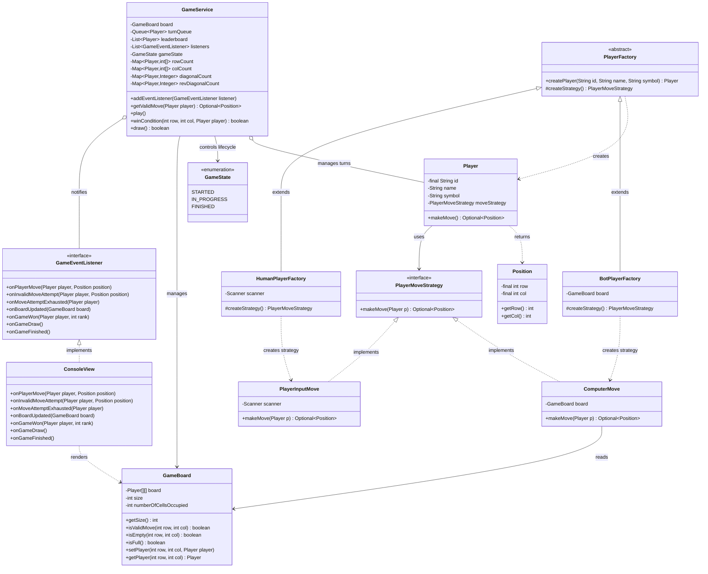

# Tic-Tac-Toe LLD Interview Notes — Better Version

> This is my **better version of the previous Tic-Tac-Toe design**. The core strengths from the earlier version are retained, while I improved extensibility and separation of concerns using the **Observer Pattern**, **Factory Method**, and an explicit **GameState**.

---


## 📊 Architecture Diagram



### High-Level Design Flow

```text
                         ┌──────────────────┐
                         │       Main       │
                         │ Composition Root │
                         └────────┬─────────┘
                                  │
                    ┌─────────────┴─────────────┐
                    ▼                           ▼
            PlayerFactory                  GameService
            ┌──────┴──────┐              ┌───────┴────────┐
            ▼             ▼              │                │
     HumanFactory      BotFactory      GameBoard      GameState
            │             │
            ▼             ▼
     Input Strategy   Bot Strategy
            └──────┬──────┘
                   ▼
                 Player
                   │
                   │ move
                   ▼
               GameService
                   │
                   │ publishes events
                   ▼
           GameEventListener
                   │
                   ▼
              ConsoleView
```


# 1. What I Improved From My Previous Version

My previous version already had:

- `Position`
- `Player`
- `GameBoard`
- `GameService`
- Queue-based turn management
- Strategy Pattern for move selection
- Human and bot move strategies
- `Optional<Position>`
- Invalid-move retry handling
- `O(1)` winner detection using counters
- Configurable board size

The main weaknesses were:

1. UI logic was coupled with game/domain classes through `System.out.println()`.
2. Player creation was coupled directly in `main()`.
3. The game lifecycle was implicit.
4. `Position` was mutable.
5. Resource handling for `Scanner` was weaker.

In this Better version I specifically addressed these issues.

---

# 2. Architecture Overview

```text
                         +----------------------+
                         |      Main            |
                         | composition root     |
                         +----------+-----------+
                                    |
                    +---------------+---------------+
                    |                               |
                    v                               v
          +------------------+            +------------------+
          | PlayerFactory    |            | GameService      |
          +--------+---------+            +--------+---------+
                   |                               |
          +--------+---------+                     |
          |                  |                     |
          v                  v                     v
+-------------------+ +-------------------+  +-------------+
| HumanPlayerFactory| | BotPlayerFactory  |  | GameBoard   |
+---------+---------+ +---------+---------+  +-------------+
          |                     |
          v                     v
+-------------------+ +-------------------+
| PlayerInputMove   | | ComputerMove      |
+---------+---------+ +---------+---------+
          \                     /
           \                   /
            v                 v
             +----------------+
             |PlayerMoveStrategy|
             +----------------+

GameService
    |
    | notifies
    v
+----------------------+
| GameEventListener    |
+----------+-----------+
           |
           v
+----------------------+
| ConsoleView          |
+----------------------+
```

The important dependency direction is:

- Domain/game logic should not depend directly on console rendering.
- `GameService` publishes game events.
- Views react to those events.

---

# 3. `GameState` — Explicit Game Lifecycle

```java
enum GameState {
    STARTED,
    IN_PROGRESS,
    FINISHED
}
```

### Why I added it

In the earlier version, game state was mostly controlled by loop conditions and `return` statements.

Now the lifecycle is explicit.

The game starts as:

```java
STARTED
```

When `play()` begins:

```java
IN_PROGRESS
```

When the game ends:

```java
FINISHED
```

### Good
This makes the state machine easier to understand and extend.

Future states could include:

```text
PAUSED
CANCELLED
WAITING_FOR_PLAYERS
```

### Interview answer

> I introduced GameState to make the lifecycle explicit instead of relying only on control flow. This improves readability and makes future state transitions easier to manage.

---

# 4. `Position` — Improved Immutability

In the Better version:

```java
private final int row, col;
```

There are no setters.

### Why this is better

A position is a value object representing one coordinate.

After creating:

```java
new Position(1, 2)
```

it should not accidentally become:

```java
(0, 0)
```

### Good improvement over the previous version

**Previous:** mutable position with setters.

**Better:** immutable position.

### Interview explanation

> Position is a value object, so I made it immutable. Once a move is created, its row and column should not change.

---

# 5. `Player` — Domain Entity + Strategy Delegation

`Player` contains:

- immutable `id`,
- `name`,
- `symbol`,
- `PlayerMoveStrategy`.

The key method is:

```java
public Optional<Position> makeMove() {
    return moveStrategy.makeMove(this);
}
```

The Player delegates move selection.

This preserves the earlier Strategy Pattern design.

---

# 6. Strategy Pattern — Move Selection

## Interface

```java
interface PlayerMoveStrategy {
    Optional<Position> makeMove(Player p);
}
```

## Human strategy

```text
PlayerInputMove
```

Reads input from the user.

## Bot strategy

```text
ComputerMove
```

Currently chooses the first empty position.

### Why Strategy Pattern?

The game should not care how a move is generated.

It only asks the current player:

> What position do you want to play?

Possible future implementations:

```text
RandomMoveStrategy
EasyBotMoveStrategy
HardBotMoveStrategy
MinimaxMoveStrategy
RemotePlayerMoveStrategy
```

### Strong interview statement

> Strategy isolates the variable behavior—how a move is selected—from the stable Player and GameService abstractions. New move algorithms can be added without changing the game loop.

---

# 7. Factory Method Pattern — Player Creation

This is one of the major improvements.

## Abstract factory

```java
abstract class PlayerFactory {
    public Player createPlayer(String id, String name, String symbol) {
        PlayerMoveStrategy moveStrategy = createStrategy();
        return new Player(id, name, symbol, moveStrategy);
    }

    abstract protected PlayerMoveStrategy createStrategy();
}
```

The base class controls the common creation process:

```text
createPlayer()
    |
    +--> create appropriate strategy
    |
    +--> create Player
```

Subclasses decide which strategy to create.

---

## `HumanPlayerFactory`

Creates:

```java
new PlayerInputMove(scanner)
```

---

## `BotPlayerFactory`

Creates:

```java
new ComputerMove(board)
```

---

## Why this is better than the previous version

Previously `main()` directly knew how every player was assembled.

Now:

```text
Main
 |
 +--> HumanPlayerFactory
 |
 +--> BotPlayerFactory
```

The construction details are encapsulated.

### Interview explanation

> I used Factory Method because player creation may vary based on player type. The common Player creation flow remains centralized, while each concrete factory decides which move strategy the created player should receive.

### Important nuance

This pattern is useful here because the created `Player` differs in behavior through its strategy.

Do not claim the factory is mandatory. For a very small two-player application, direct construction would also work. The value here is future extensibility.

---

# 8. Observer Pattern — Decoupling Game Logic From UI

This is the biggest architectural improvement.

## Listener interface

```java
interface GameEventListener {
    void onPlayerMove(Player player, Position position);
    void onInvalidMoveAttempt(Player player, Position position);
    void onMoveAttemptExhausted(Player player);
    void onBoardUpdated(GameBoard board);
    void onGameWon(Player player, int rank);
    void onGameDraw();
    void onGameFinished();
}
```

`GameService` publishes events instead of directly printing messages.

---

# 9. `ConsoleView` — Presentation Layer

`ConsoleView` implements:

```java
GameEventListener
```

It handles presentation:

- move messages,
- invalid-move messages,
- exhausted attempts,
- board rendering,
- winner messages,
- draw messages,
- finished messages.

For example:

```java
@Override
public void onBoardUpdated(GameBoard board) {
    ...
}
```

The board is rendered using player symbols.

### Why this is better

Previously:

```text
GameBoard -> System.out.println()
GameService -> System.out.println()
Move strategies -> System.out.println()
```

Now the intended direction is:

```text
GameService
    -> event
    -> listener
    -> ConsoleView
    -> System.out.println()
```

### Benefit

A future UI can be added without changing `GameService`.

Examples:

```text
ConsoleView
WebSocketView
GUIView
GameAnalyticsListener
AuditListener
```

### Interview answer

> I used the Observer Pattern to decouple game events from their consumers. GameService knows that a move happened, but it does not need to know whether the event should be displayed on a console, sent to a UI, logged, or recorded for analytics.

---

# 10. Observer Implementation Flow

Listeners are registered through:

```java
public void addEventListeners(GameEventListener listener) {
    this.listeners.add(listener);
}
```

Example registration:

```java
gameService.addEventListeners(new ConsoleView());
```

After a valid move:

```java
notifyOnPlayerMove(player, move);
notifyOnBoardUpdated(board);
```

When a player wins:

```java
notifyOnGameWon(player, leaderboard.size());
```

The service iterates over listeners:

```java
for(GameEventListener listener: listeners) {
    listener.onPlayerMove(player, position);
}
```

### Good
This follows the standard publisher/subscriber idea.

### Could be improved
The method name is plural:

```java
addEventListeners
```

but it adds only one listener.

A clearer name would be:

```java
addEventListener
```

---

# 11. `GameBoard` — Board State Only

The Better version removes board printing from `GameBoard`.

This is an important SRP improvement.

The board now focuses on:

- board state,
- bounds checking,
- empty-cell checking,
- full-board checking,
- placing players,
- retrieving players.

### Improvement over the previous version

**Previous version:**

```text
GameBoard
    + state
    + validation
    + printing
```

**Better version:**

```text
GameBoard
    + state
    + validation
```

Rendering moved to `ConsoleView`.

This is cleaner separation of concerns.

---

# 12. `GameService` — Orchestration

`GameService` owns:

- `GameBoard`
- turn queue
- leaderboard
- event listeners
- game state
- win counters

It coordinates the application flow.

### Constructor initialization

For every player, it initializes:

```java
rowCount
colCount
diagonalCount
revDiagonalCount
```

This is necessary because winner detection is tracked per player.

---

# 13. Turn Management With Queue

```java
private Queue<Player> turnQueue;
```

Flow:

```text
poll current player
        |
        v
get valid move
        |
        +--> no valid move -> notify + add player back
        |
        +--> valid move
                 |
                 v
              update board
                 |
                 v
            check winner
                 |
       +---------+---------+
       |                   |
      win                 no win
       |                   |
  don't re-add        check draw
                           |
                     +-----+-----+
                     |           |
                    draw       continue
                                 |
                              re-add player
```

### Good
The queue naturally models round-robin turns.

It also supports more than exactly two players.

---

# 14. Invalid Move Handling

`getValidMove()`:

1. asks the player for a move,
2. validates the position,
3. notifies listeners on invalid moves,
4. retries,
5. returns a valid position,
6. otherwise returns `Optional.empty()`.

The current implementation has:

```java
int attempsLeft = 10;
```

### Improvement needed

Typo:

```text
attempsLeft
```

should be:

```text
attemptsLeft
```

Also use:

```java
private static final int MAX_INVALID_ATTEMPTS = 10;
```

instead of a magic number.

### Good design
The retry logic remains outside the main game loop, keeping `play()` more readable.

---

# 15. Efficient `O(1)` Win Detection

This remains one of the strongest parts of both versions.

For every player:

```java
Map<Player, int[]> rowCount
Map<Player, int[]> colCount
Map<Player, Integer> diagonalCount
Map<Player, Integer> revDiagonalCount
```

After a move `(row, col)`:

```java
rows[row]++;
cols[col]++;
```

Main diagonal:

```java
if(row == col)
```

Reverse diagonal:

```java
if(row + col == n - 1)
```

Then:

```java
rows[row] == n
cols[col] == n
diagonalCount == n
revDiagonalCount == n
```

Any of these means the player won.

### Complexity

Winner checking is:

```text
O(1) per move
```

### Interview answer

> Rather than scanning the board after every move, I maintain incremental counts for each player's rows, columns, and diagonals. A move only affects a constant number of counters, so checking for a winner is O(1).

---

# 16. Draw Detection

```java
public boolean draw() {
    return board.isFull();
}
```

The board maintains:

```java
numberOfCellsOccupied
```

Therefore full-board checking is `O(1)`.

The order is correct:

```java
if(winCondition(...)) {
    ...
} else if(draw()) {
    ...
}
```

A winning move on the final empty cell must be treated as a win, not a draw.

---

# 17. What Is Good About This Better Version

## 1. Better separation of concerns

Game logic no longer directly owns board rendering.

## 2. Observer Pattern is meaningful

Events have multiple potential consumers.

## 3. Factory Method removes construction coupling

Player creation can evolve without making `main()` know every implementation detail.

## 4. Explicit game lifecycle

`GameState` makes transitions visible.

## 5. Immutable `Position`

Prevents accidental coordinate mutation.

## 6. Strategy Pattern remains clean

Move behavior remains independently extensible.

## 7. Efficient winner detection

`O(1)` per move.

## 8. Configurable board size

Not tied to `3 x 3`.

## 9. Multi-player-ready turn model

Queue and per-player counters support generalized gameplay.

## 10. Better resource cleanup

The `Scanner` is closed in `finally`.

---

# 18. What Could Still Be Improved

This is better, but not perfect. The following are useful interview discussion points.

---

## Improvement 1 — Move strategies still contain UI concerns

`PlayerInputMove` prints:

```java
System.out.println(...)
```

`ComputerMove` also prints its selected position.

This means the UI is not completely decoupled yet.

### Better approach

Move input and output could be handled by an input/view abstraction.

For example:

```text
MoveInputProvider
```

or the human strategy could receive a dedicated input interface.

Then all presentation remains outside strategy/domain logic.

This is the biggest remaining inconsistency after introducing Observer.

---

## Improvement 2 — `GameService` still has several responsibilities

It currently handles:

- game lifecycle,
- turn orchestration,
- move validation,
- retry policy,
- leaderboard,
- winner counters,
- event publication.

For this problem size, this is acceptable.

If requirements grow, extract:

```text
TurnManager
MoveValidator
GameRules / WinningRule
LeaderboardService
GameEventPublisher
```

### Important interview point

Do not split these classes too early.

For a small LLD problem, excessive abstraction can be over-engineering.

---

## Improvement 3 — Extract winning rules for more flexibility

Currently:

```java
winCondition(...)
```

is inside `GameService`.

A more extensible design could introduce:

```java
interface WinningRule {
    boolean isWinningMove(GameBoard board, Position position, Player player);
}
```

Possible implementations:

```text
StandardTicTacToeWinningRule
ConnectKWinningRule
CustomWinningRule
```

This is useful if the game requirements vary.

---

## Improvement 4 — Use a `BoardCell` or symbol abstraction if needed

The board stores:

```java
Player[][]
```

This is fine because each occupied cell belongs to a player.

For richer games, a cell abstraction could hold additional metadata.

For current requirements, `Player[][]` is simpler and preferable.

---

## Improvement 5 — Validate constructor arguments

Possible checks:

```text
board size > 0
players not null
minimum required players
unique player IDs
unique symbols
```

The exact validation depends on requirements.

---

## Improvement 6 — Avoid using mutable domain objects as map keys

The maps use:

```java
Map<Player, ...>
```

Since `Player` does not override `equals()` and `hashCode()`, identity-based behavior is currently used.

This works because the same Player instances are consistently used.

However, alternatives include:

```text
Map<String, ...> using player id
```

or implementing stable equality based on immutable `id`.

Be careful: if equality depends on mutable fields such as name or symbol, map behavior can become dangerous.

---

## Improvement 7 — Encapsulate mutable collections

Fields such as:

```java
turnQueue
leaderboard
listeners
```

could be `final` references.

Example:

```java
private final Queue<Player> turnQueue;
```

The collection contents can still change while the reference remains stable.

---

## Improvement 8 — Better event API

`onGameFinished()` does not currently communicate useful result information.

A future event could contain:

```text
final rankings
winner
termination reason
game state
```

For example:

```java
void onGameFinished(GameResult result);
```

This reduces fragmented event data.

---

## Improvement 9 — Error handling

`main()` catches broad:

```java
Exception
```

For interview/demo code, this is understandable.

For stronger production code:

- catch expected exceptions,
- log unexpected failures,
- avoid hiding stack traces during debugging.

---

## Improvement 10 — Input handling

`nextInt()` fails on non-numeric input.

A robust console implementation should handle invalid token input gracefully.

---

## Improvement 11 — Observer thread safety

The current design is synchronous and suitable for a single-threaded console game.

If listeners can be added/removed concurrently or events become asynchronous, thread safety and failure isolation would need attention.

For this current use case, adding concurrency machinery would likely be unnecessary over-engineering.

---

# 19. SOLID Analysis

## S — Single Responsibility Principle

### Strong improvement

- `GameBoard` → board state.
- `ConsoleView` → presentation.
- `PlayerFactory` → player construction.
- `PlayerMoveStrategy` → move-selection behavior.
- `GameService` → orchestration.

### Remaining issue
`GameService` is still somewhat broad, but acceptable for the current scope.

---

## O — Open/Closed Principle

Good.

Add a new move strategy without changing the existing game loop:

```text
MinimaxMoveStrategy
```

Add a new view/listener:

```text
WebView
AnalyticsListener
```

Add a new player type/factory:

```text
RemotePlayerFactory
```

Existing core code requires little or no modification.

---

## L — Liskov Substitution Principle

Concrete implementations can substitute their abstractions:

```text
PlayerInputMove / ComputerMove -> PlayerMoveStrategy
HumanPlayerFactory / BotPlayerFactory -> PlayerFactory
ConsoleView -> GameEventListener
```

The code depends on contracts rather than specific subclasses.

---

## I — Interface Segregation Principle

`PlayerMoveStrategy` is small and focused.

`GameEventListener` is more questionable because every listener must implement all event methods.

If different listener types only care about some events, alternatives include:

- smaller listener interfaces,
- an adapter class,
- a generic event object.

For this small application, the current interface is still understandable.

---

## D — Dependency Inversion Principle

Improved significantly.

`Player` depends on:

```java
PlayerMoveStrategy
```

rather than concrete move implementations.

`GameService` publishes to:

```java
GameEventListener
```

rather than depending directly on `ConsoleView`.

This is a strong architectural improvement over the earlier version.

---

# 20. Design Patterns Used

## 1. Strategy Pattern

### Abstraction
`PlayerMoveStrategy`

### Implementations
- `PlayerInputMove`
- `ComputerMove`

### Purpose
Encapsulates different move-selection algorithms.

---

## 2. Factory Method Pattern

### Abstraction
`PlayerFactory`

### Concrete factories
- `HumanPlayerFactory`
- `BotPlayerFactory`

### Purpose
Encapsulates player construction and lets concrete factories decide which strategy a player receives.

---

## 3. Observer Pattern

### Subject / publisher role
`GameService`

### Observer abstraction
`GameEventListener`

### Concrete observer
`ConsoleView`

### Purpose
Decouples game events from presentation and other possible consumers.

---

# 21. Complexity

| Operation | Complexity |
|---|---:|
| Validate move | `O(1)` |
| Place player | `O(1)` |
| Check board full | `O(1)` |
| Win check | `O(1)` |
| Event notification | `O(L)` where `L` = listeners |
| Bot first-empty search | `O(n²)` worst case |
| Board rendering | `O(n²)` |
| Board memory | `O(n²)` |
| Winner counter memory | `O(P × n)` |

For the current `ComputerMove`, the first-empty search can be optimized in future if necessary, but for Tic-Tac-Toe board sizes this is not a practical bottleneck.

---

# 22. Likely Interview Questions

## Q1. Why Observer Pattern?

> I wanted GameService to focus on state transitions and game rules rather than presentation. Instead of directly printing messages, it emits events. ConsoleView subscribes to those events, so I can add other consumers such as a GUI, logger, or analytics listener without changing the core game logic.

---

## Q2. Why Factory Method?

> Player construction differs based on the type of player because each player receives a different move strategy. The base factory contains the common Player construction flow, while concrete factories decide which strategy to inject.

---

## Q3. Why both Factory and Strategy?

> They solve different problems. Strategy handles runtime behavior—how a player selects a move. Factory handles object construction—how a correctly configured player is created. The factory wires the appropriate strategy into the player.

---

## Q4. How do you detect the winner efficiently?

> I maintain row, column, and diagonal counters for each player. After a move, I update only the affected counters. If one reaches the board size, that player wins. Therefore winner checking is O(1) per move.

---

## Q5. Why use a Queue?

> A queue naturally supports round-robin turn rotation. I poll the active player and re-add the player after a non-terminal turn. This also generalizes better than a hard-coded currentPlayer toggle.

---

## Q6. Why is `Position` immutable?

> Position is a value object. A move should represent fixed coordinates once created, so immutability prevents accidental mutation and makes the object safer to pass around.

---

## Q7. What would you improve next?

> First, I would remove the remaining console output from move strategies to fully separate presentation from core behavior. Then, if requirements demanded more game variants, I would extract winning rules and possibly move validation into separate abstractions.

---

## Q8. Is this over-engineered for basic Tic-Tac-Toe?

> For a simple two-player console game, yes, some patterns would be unnecessary. I chose them because the design is intended as an extensible LLD exercise. In an interview, I would first clarify requirements and start simpler, adding abstractions when extensibility requirements justify them.

This answer is important because it demonstrates engineering judgment.

---

# 23. Best 60-Second Explanation

> This is the improved version of my previous Tic-Tac-Toe LLD. I kept the core separation between Player, Position, GameBoard, and GameService, along with Strategy Pattern for move selection. A human and a bot differ only in their PlayerMoveStrategy, so new bot algorithms can be added without changing the game loop. I use a Queue for round-robin turn management and maintain per-player row, column, and diagonal counters, giving O(1) winner detection after every move. Compared with my previous version, I introduced the Observer Pattern so GameService publishes events instead of directly handling UI, and ConsoleView handles presentation. I also introduced Factory Method to encapsulate creation of human and bot players, added an explicit GameState lifecycle, and made Position immutable.

---

# 24. Best Deep-Dive Explanation of the Evolution

> My earlier version had good core logic, but I noticed that several classes were directly printing to the console and Main was directly assembling players with concrete strategies. That meant changes to UI or player creation could affect core code. In the improved version, I introduced GameEventListener and ConsoleView so the service publishes events and the presentation layer reacts independently. I also added PlayerFactory with concrete HumanPlayerFactory and BotPlayerFactory so object creation is separated from the composition root. Finally, I made Position immutable and added GameState for clearer lifecycle management. I deliberately retained the counter-based winner detection and Strategy Pattern because those were already good design choices from the earlier version.

---

# 25. Overall Assessment

## Strength: **Strong LLD interview version**

This version demonstrates:

- Good object decomposition.
- Encapsulation.
- Strategy Pattern.
- Factory Method Pattern.
- Observer Pattern.
- Improved Dependency Inversion.
- Better SRP separation.
- Immutable value object design.
- Explicit lifecycle state.
- Queue-based turn management.
- `O(1)` winner detection.
- Awareness of trade-offs and over-engineering.

## Most important remaining improvement

The next cleanup should be:

> Remove the remaining `System.out.println()` calls from `PlayerInputMove` and `ComputerMove` so presentation concerns are fully centralized.

---

# 26. Final Evolution Summary

```text
VERSION 1 — GOOD
----------------
Position
Player
GameBoard
GameService
Strategy Pattern
Queue turn management
O(1) win detection

Main limitations:
- UI mixed with core logic
- Concrete construction in Main
- No explicit lifecycle
- Mutable Position


VERSION 2 — BETTER
------------------
Everything from Version 1, plus:

+ Immutable Position
+ GameState
+ Observer Pattern
+ GameEventListener
+ ConsoleView
+ Factory Method
+ HumanPlayerFactory
+ BotPlayerFactory
+ Scanner cleanup

Result:
Better separation of concerns, extensibility, and dependency management.
```

## Final interview takeaway

> The improvement is not just that I added more design patterns. Each change addresses a concrete weakness in the previous design: Strategy handles varying move behavior, Factory handles varying player construction, Observer handles varying consumers of game events, and GameState makes lifecycle explicit.

---


# Amazon SDE I LLD / Machine Coding Rating

## Overall Rating: **8.7 / 10**

### What would score well
- Clear evolution from the earlier design.
- Correct and meaningful Strategy Pattern.
- Correct Factory Method usage for player construction.
- Meaningful Observer Pattern for event/UI decoupling.
- Explicit `GameState`.
- Immutable `Position`.
- Strong `O(1)` winner detection.
- Queue-based turn rotation.
- Configurable board and multi-player-ready structure.
- Better separation of responsibilities and dependency direction.

### Why it is not a 10/10
- `PlayerInputMove` and `ComputerMove` still contain `System.out.println()`, so UI decoupling is incomplete.
- `GameService` still owns several concerns.
- `GameEventListener` is somewhat broad.
- Mutable `Player` is used as a `HashMap` key.
- Input validation could handle non-integer input better.
- Broad exception handling remains.
- Some naming issues such as `addEventListeners` for adding one listener and `attempsLeft`.

### Amazon SDE I Assessment

**Verdict: Strong SDE I-level LLD solution.**

For an Amazon SDE I interview, I would rate this as **above average**, especially if I can clearly explain *why each abstraction exists* rather than simply naming patterns.

The strongest point is the evolution:

> I did not start by forcing Factory and Observer into the solution. I first built the core game, identified coupling problems, and then introduced abstractions to solve specific design issues.

That reasoning is valuable in an interview.

**Estimated impression:** `Strong SDE I design fundamentals with good extensibility and trade-off awareness.`

### My practical score breakdown

| Area | Score |
|---|---:|
| Object-Oriented Design | 9/10 |
| SOLID / Separation of Concerns | 8.5/10 |
| Design Pattern Usage | 9/10 |
| Extensibility | 9/10 |
| Correctness of Core Design | 9/10 |
| Simplicity / Avoiding Over-engineering | 8/10 |
| Code Polish / Production Readiness | 8/10 |
| **Overall Amazon SDE I LLD** | **8.7/10** |

