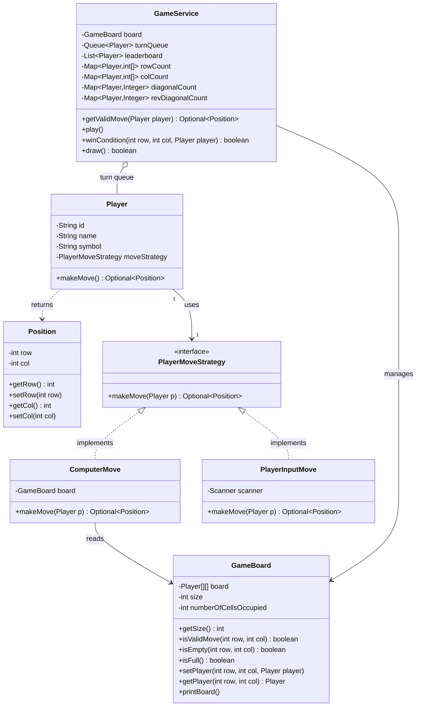

# Tic-Tac-Toe LLD Interview Notes — Good Version

> This document reviews the **Good** version of the Tic-Tac-Toe implementation: the simpler version before the later Observer + Factory + GameState improvements.

---


## 📊 Architecture Diagram



### Relationship Summary

```text
Player
  │
  └── uses ──> PlayerMoveStrategy
                   ▲
              ┌────┴─────┐
              │          │
     PlayerInputMove  ComputerMove
                           │
                           └── reads ──> GameBoard

GameService
  ├── manages ──> GameBoard
  ├── manages ──> Queue<Player>
  ├── maintains ──> Leaderboard
  └── maintains ──> O(1) row/column/diagonal counters
```


## 1. What I Built

I designed a configurable Tic-Tac-Toe game with:

- A configurable `GameBoard` size.
- Multiple players managed through a `Queue<Player>`.
- Human and computer players.
- A pluggable move-selection mechanism using the **Strategy Pattern**.
- Validation of invalid or occupied moves.
- A limit of 10 invalid attempts before skipping a turn.
- Efficient win detection using row, column, and diagonal counters.
- Support for ranking/elimination-style gameplay through a `leaderboard`.
- `Optional<Position>` to represent the presence or absence of a move.

The core flow is:

`Player -> MoveStrategy -> Position -> GameService validation -> GameBoard update -> Win/Draw check`

---

# 2. Class-by-Class Design

## `Position`

### Responsibility
Represents a board coordinate using:

- `row`
- `col`

### What I did
I created getters and setters.

### Good
- Separates coordinates from game logic.
- Makes method signatures cleaner than passing `row` and `col` everywhere.

### Could be improved
A position should ideally be immutable because coordinates represent a value.

```java
private final int row;
private final int col;
```

Then remove setters.

**Why?** A move should not accidentally change from `(1, 2)` to another position after creation.

---

## `Player`

### Responsibility
Stores player-related information:

- `id`
- `name`
- `symbol`
- `moveStrategy`

It delegates move generation to:

```java
public Optional<Position> makeMove() {
    return moveStrategy.makeMove(this);
}
```

### Pattern used: Strategy Pattern

The player does not know whether it is:

- a human,
- a simple bot,
- a random bot,
- a minimax bot,
- or some future remote player.

Instead, behavior is delegated to `PlayerMoveStrategy`.

### Good
This follows **composition over inheritance**.

Instead of:

```text
HumanPlayer extends Player
BotPlayer extends Player
```

I kept the domain object separate from move behavior.

### Could be improved
`moveStrategy` currently has no setter, which is fine if strategy should remain fixed. If runtime difficulty switching is a requirement, a controlled setter could be introduced.

---

## `GameBoard`

### Responsibility
Owns board state and board-level operations.

It handles:

- board creation,
- move validity,
- empty-cell checks,
- full-board checks,
- occupied-cell count,
- placing a player,
- reading a player from a cell.

### Good separation
`GameBoard` owns the actual state:

```java
private Player[][] board;
private int size;
private int numberOfCellsOccupied;
```

The service does not directly manipulate the array.

That is good encapsulation.

### Validation
Before placing a player:

```java
if(!isValidMove(row, col)) {
    throw new IllegalArgumentException(...);
}
```

This gives the board a defensive boundary.

### Good
The board tracks:

```java
numberOfCellsOccupied
```

so checking whether the board is full is `O(1)`.

### Could be improved

#### 1. Make fields more immutable where possible

```java
private final Player[][] board;
private final int size;
```

#### 2. Printing should not belong to the board

`printBoard()` mixes domain state with console/UI logic.

The board should manage state; a separate view/presenter should render it.

This became an important improvement in the later Better version.

#### 3. Output uses player names

Printing names may make the board visually unclear:

```text
John NULL Bot
```

Symbols such as `X` and `O` are better for board rendering.

---

# 3. Strategy Pattern

## `PlayerMoveStrategy`

```java
interface PlayerMoveStrategy {
    Optional<Position> makeMove(Player p);
}
```

### Why it exists
It abstracts **how a player chooses a move**.

The game engine only asks:

> Give me a move.

It does not care how that move was generated.

### Implementations

#### `PlayerInputMove`
Reads row and column from the user.

#### `ComputerMove`
Currently selects the first empty cell.

### Interview explanation

> I used the Strategy Pattern because move selection is behavior that can vary independently from the Player entity. A human gets input from the console, while a bot can use an algorithm. The GameService remains unchanged when I add new strategies such as RandomMoveStrategy or MinimaxMoveStrategy.

### Good
This is a genuine use of Strategy Pattern, not just an interface created without variation.

### Could be improved
`ComputerMove` depends directly on `GameBoard`. This is reasonable for now, but the strategy could eventually receive a read-only board abstraction or game context.

---

# 4. `GameService` — Main Orchestrator

### Responsibility
`GameService` coordinates the game.

It manages:

- turn order,
- move validation,
- retry attempts,
- board updates,
- win detection,
- draw detection,
- leaderboard.

This is the central application/service layer.

### Turn management

```java
private Queue<Player> turnQueue;
```

A queue provides a clean round-robin flow:

1. Poll the current player.
2. Let the player make a move.
3. If still in the game, add the player back.

This avoids manually maintaining a current-player index.

### Good
The queue is a good choice for scalable multi-player turn rotation.

---

# 5. Invalid Move Handling

The method:

```java
getValidMove(Player player)
```

separates move validation from the main game loop.

### Flow

1. Ask the player for a move.
2. Validate it.
3. If invalid, retry.
4. Allow up to 10 invalid attempts.
5. Return a valid move if one is obtained.
6. Otherwise return `Optional.empty()`.

### Good
The main `play()` method stays cleaner because retry logic is extracted.

### Use of `Optional`

A move can be absent:

```java
Optional.empty()
```

This is better than using `null` to represent "no valid move".

### Could be improved

#### Naming
There is a typo:

```java
attempsLeft
```

Should be:

```java
attemptsLeft
```

#### Semantics of 10 attempts
The current logic initializes `attemptsLeft = 10` and decrements after each invalid retry. In an interview, clearly define whether the first submitted move counts as one of the 10 attempts.

A clearer approach would explicitly define:

```text
MAX_INVALID_ATTEMPTS
```

as a constant.

For example:

```java
private static final int MAX_INVALID_ATTEMPTS = 10;
```

#### Bot edge case
If a strategy repeatedly returns invalid positions, it eventually loses its turn. That is acceptable under the current rule, but a production design may distinguish between:

- user invalid input,
- strategy failure,
- no legal moves available.

---

# 6. Win Detection Optimization

This is one of the strongest parts of the design.

Instead of scanning an entire row, column, and diagonals after every move, I maintain counters for each player.

```java
Map<Player, int[]> rowCount;
Map<Player, int[]> colCount;
Map<Player, Integer> diagonalCount;
Map<Player, Integer> revDiagonalCount;
```

After a move at `(row, col)`:

```java
rows[row]++;
cols[col]++;
```

If:

```java
row == col
```

increment the main diagonal count.

If:

```java
row + col == n - 1
```

increment the reverse diagonal count.

Then check whether any count equals `n`.

### Complexity

#### Naive approach
Potentially `O(n)` work per move.

#### Counter-based approach
`O(1)` work per move.

### Interview explanation

> I optimized winner detection by maintaining row, column, and diagonal counters per player. After each move, I only update the affected row, column, and possibly diagonals, then check whether any counter reaches the board size. Therefore win checking is O(1) per move.

### Important design insight
The counters are maintained in `GameService`, not in `GameBoard`.

This is defensible because the board owns occupancy state, while the service owns the game-rule orchestration.

However, if winner evaluation becomes more complex, a dedicated `WinStrategy` or `WinningRule` abstraction would be cleaner.

---

# 7. Draw Detection

```java
public boolean draw() {
    return board.isFull();
}
```

Because occupied cells are counted during placement, this is `O(1)`.

### Good
Simple and efficient.

### Important
Draw is checked only after confirming that the move did not win:

```java
if(winCondition(...)) {
    ...
} else if(draw()) {
    ...
}
```

That ordering is correct.

A final move can both fill the board and complete a winning line, so win must take precedence.

---

# 8. Leaderboard / Elimination Logic

When a player wins:

```java
leaderboard.add(player);
```

The player is not re-added to the turn queue.

This means the game can continue among remaining players.

Eventually, when one player remains:

```java
if(turnQueue.size() == 1)
```

that player receives the final rank.

### Good
This design goes beyond standard two-player Tic-Tac-Toe and attempts to support multiple players.

### Potential concern
For a traditional Tic-Tac-Toe interview problem, requirements usually stop when the first player wins.

Therefore, explain the requirement explicitly:

> I generalized the design so winners are removed and ranked, allowing an elimination-style multi-player variant.

Otherwise, an interviewer may ask why the game continues after someone wins.

---

# 9. What Is Good About This Version

## Good 1 — Clear responsibilities

- `Position` → coordinate value.
- `Player` → player data and move delegation.
- `GameBoard` → board state.
- `PlayerMoveStrategy` → move behavior.
- `GameService` → orchestration and game flow.

## Good 2 — Correct Strategy Pattern usage

Different move behaviors can be added without modifying the core game flow.

## Good 3 — Queue for turn management

The queue naturally models turn rotation.

## Good 4 — Efficient winner detection

Counter-based win checking gives `O(1)` processing per move.

## Good 5 — Configurable board size

The design is not hard-coded to `3 x 3`.

## Good 6 — Defensive validation

The board validates moves before changing state.

## Good 7 — `Optional` instead of `null`

Absence of a valid move is explicitly represented.

## Good 8 — Retry logic is extracted

`getValidMove()` prevents the main game loop from becoming too cluttered.

## Good 9 — Generalized toward multiple players

The queue and leaderboard make the design more extensible than a hard-coded two-player solution.

---

# 10. What Could Be Improved

## Improvement 1 — Separate UI from domain logic

This is the biggest improvement area.

Currently, classes directly print messages:

- `GameBoard.printBoard()`
- `ComputerMove`
- `PlayerInputMove`
- `GameService`

This creates coupling between the game engine and the console.

A better approach is:

```text
GameService
    |
    | emits events
    v
GameEventListener
    |
    +--> ConsoleView
    +--> GUIView
    +--> WebSocketView
```

This is implemented in the Better version using the Observer Pattern.

---

## Improvement 2 — Player creation is hard-coded

In `main()`:

```java
new Player(... new PlayerInputMove(...))
new Player(... new ComputerMove(board))
```

`main()` knows too much about construction details.

A Factory can encapsulate creation of:

- human players,
- bots,
- future easy/hard bots,
- remote players.

This is implemented in the Better version.

---

## Improvement 3 — No explicit game state

The Good version relies primarily on loop conditions and returns.

A state such as:

```text
STARTED
IN_PROGRESS
FINISHED
```

makes lifecycle clearer and easier to extend.

---

## Improvement 4 — `Position` should be immutable

Coordinates are value-like data.

Use:

```java
private final int row;
private final int col;
```

and remove setters.

---

## Improvement 5 — Use constants

Examples:

```java
private static final int MAX_INVALID_ATTEMPTS = 10;
```

This avoids magic numbers.

---

## Improvement 6 — Better exception handling

`main()` catches:

```java
Exception
```

which is broad.

A better design catches expected exceptions or allows unexpected failures to surface appropriately.

Also, `e.getMessage()` may be `null` and loses stack-trace information during debugging.

---

## Improvement 7 — Input robustness

`scanner.nextInt()` can throw an exception for non-integer input.

A production-quality console implementation should handle malformed input and ask again.

---

## Improvement 8 — Encapsulation and immutability

Fields that do not change should be `final`, especially references such as board size and the board array.

---

## Improvement 9 — Introduce rule abstractions only when needed

Current `GameService` contains the winning rule directly.

If requirements grow, extract:

```text
WinStrategy / WinningRule
DrawRule
GameRule
```

Do not over-engineer for a simple interview problem unless extensibility is explicitly required.

---

# 11. SOLID Analysis

## S — Single Responsibility Principle

### Mostly good
- `Player` mostly handles player data.
- `GameBoard` handles board state.
- `GameService` handles orchestration.

### Violation / improvement
Console printing appears in multiple domain classes, giving them presentation responsibilities too.

**Better version improves this through `ConsoleView`.**

---

## O — Open/Closed Principle

### Good for move behavior
New move strategies can be added:

```text
RandomMoveStrategy
MinimaxMoveStrategy
RemoteMoveStrategy
```

without changing `GameService`.

### Could improve
UI and player creation are still closed to extension because console output and concrete construction are embedded in the implementation.

---

## L — Liskov Substitution Principle

There is no inheritance hierarchy that meaningfully tests LSP here.

The strategy implementations can substitute for `PlayerMoveStrategy`, which is a good interface-based design.

---

## I — Interface Segregation Principle

`PlayerMoveStrategy` is small and focused:

```java
makeMove(...)
```

Good.

---

## D — Dependency Inversion Principle

Partial improvement exists because `Player` depends on the abstraction:

```java
PlayerMoveStrategy
```

But other places depend directly on concrete implementation details, such as console I/O and concrete strategy construction.

The Better version improves dependency boundaries further with listeners and factories.

---

# 12. Design Patterns Used

## 1. Strategy Pattern

### Where?
`PlayerMoveStrategy`

### Implementations
- `PlayerInputMove`
- `ComputerMove`

### Why?
Move selection can change independently of the Player and GameService.

---

## 2. Queue-Based Turn Rotation

Not a GoF design pattern, but an important design choice.

### Why?
It naturally supports round-robin turns and can scale beyond two players.

---

# 13. Complexity

| Operation | Complexity |
|---|---:|
| Validate move | `O(1)` |
| Place move | `O(1)` |
| Check board full | `O(1)` |
| Win check | `O(1)` |
| Bot first-empty search | `O(n²)` worst case |
| Board printing | `O(n²)` |
| Memory for board | `O(n²)` |
| Winner counters | `O(players × n)` |

The counter-based win detection is a strong optimization.

---

# 14. Likely Interview Questions and Answers

## Q1. Why did you use Strategy Pattern?

> A player's identity and the way the player chooses a move are separate concerns. Human input, a simple bot, and an AI bot all choose moves differently. Strategy allows me to add those behaviors without changing the Player or GameService.

## Q2. Why a Queue for players?

> A queue naturally represents turn rotation. I poll the current player and add the player back after a successful non-winning turn. It also generalizes the design beyond exactly two players.

## Q3. How is winner checking O(1)?

> I maintain row and column counters for every player and separate counters for both diagonals. After a move, I update only the affected counters and check whether any reaches the board size.

## Q4. Why keep counters per player?

> In a multi-player board, a row may contain cells belonging to different players. A single row count is insufficient. Each player's contribution to each row and column must be tracked separately.

## Q5. Why check win before draw?

> The last move may fill the board and also create a winning line. Therefore winning must be checked first.

## Q6. What is the biggest weakness of this version?

> The biggest weakness is that presentation is coupled with the domain and service logic through `System.out.println()`. I improved this in my next version using the Observer Pattern and a separate ConsoleView.

---

# 15. How I Would Present This in an Interview

> I started by separating the core domain objects: Position represents coordinates, Player represents a participant, and GameBoard owns board state. For move selection, I used the Strategy Pattern so a player can use different behaviors such as console input or a bot algorithm without changing the game engine. GameService orchestrates turns using a queue, validates moves, updates the board, and checks game termination. For efficient winner detection, I maintain per-player row, column, and diagonal counters, allowing O(1) win checks after each move. The main improvement I identified was decoupling UI from game logic, which I addressed in the next version.

---

# 16. Overall Assessment

## Strength of this version: **Strong intermediate LLD**

This version demonstrates:

- OOP decomposition.
- Strategy Pattern.
- Encapsulation.
- Queue-based turn management.
- Efficient `O(1)` win detection.
- Extensibility beyond a fixed two-player game.

The main architectural limitation is **coupling with console/UI logic and concrete object creation**.

That is exactly what the Better version addresses.

---

# 17. Progress From This Version to the Better Version

The evolution is:

```text
GOOD VERSION
    |
    +-- Strategy Pattern for move behavior
    +-- Queue for turn management
    +-- O(1) winner checking
    +-- Board encapsulation
    |
    | Problems identified:
    | - UI coupled with game logic
    | - Player construction coupled in Main
    | - No explicit game lifecycle
    v
BETTER VERSION
    |
    +-- Observer Pattern -> UI decoupling
    +-- Factory Method -> player creation
    +-- GameState -> explicit lifecycle
    +-- Immutable Position
    +-- Scanner lifecycle cleanup
```

This is a meaningful improvement rather than adding patterns randomly.

---


# Amazon SDE I LLD / Machine Coding Rating

## Overall Rating: **7.5 / 10**

### What would score well
- Strong basic object decomposition.
- Correct use of Strategy Pattern.
- Good queue-based turn management.
- Excellent `O(1)` winner detection.
- Configurable board size.
- Reasonable handling of invalid moves.

### Why it is not higher
- UI is mixed into domain/game classes.
- Object construction is tightly coupled in `Main`.
- `Position` is mutable.
- Broad exception handling.
- Some naming/cleanup issues.
- The service still carries several responsibilities.

### Amazon SDE I Assessment

**Verdict: Good / interview-worthy foundation.**

For an Amazon SDE I LLD round, this demonstrates that I understand:
- OOP,
- composition,
- interfaces,
- extensibility,
- algorithmic efficiency.

However, I would expect follow-up questions around separation of concerns and extensibility. I should proactively explain that I recognized these weaknesses and improved them in the next version.

**Estimated impression:** `Solid SDE I candidate, but design polish is still needed.`

